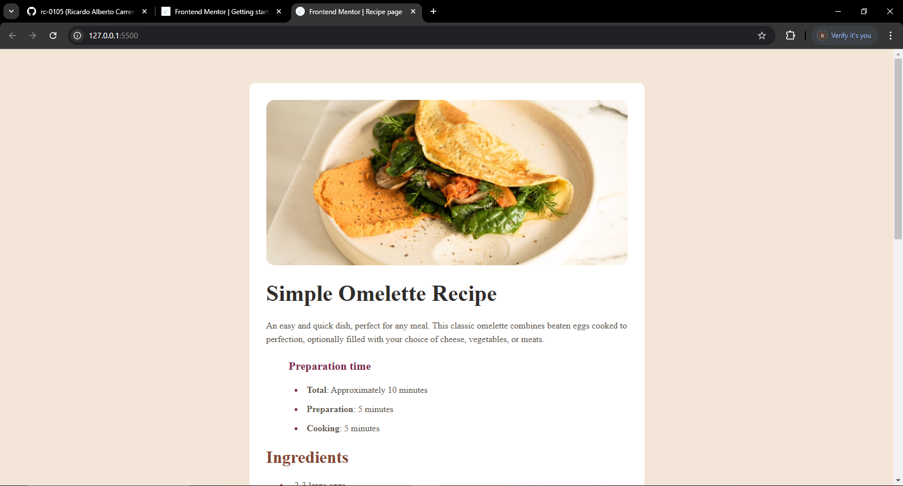

# Frontend Mentor - Recipe page solution

This is a solution to the [Recipe page challenge on Frontend Mentor](https://www.frontendmentor.io/challenges/recipe-page-KiTsR8QQKm). Frontend Mentor challenges help you improve your coding skills by building realistic projects. 

## Table of contents

- [Overview](#overview)
  - [The challenge](#the-challenge)
  - [Screenshot](#screenshot)
  - [Links](#links)
- [My process](#my-process)
  - [Built with](#built-with)
  - [What I learned](#what-i-learned)
  - [Continued development](#continued-development)
- [Author](#author)

## Overview

### Screenshot

### Links

- Solution URL: [https://github.com/rc-0105/recipe-page-main](https://github.com/rc-0105/recipe-page-main)
- Live Site URL: [https://rc-0105.github.io/recipe-page-main/](https://rc-0105.github.io/recipe-page-main/)

## My process

### Built with

- Semantic HTML5 markup
- CSS custom properties
- Flexbox

### What I learned

I learned how to aply styles to list like ul and also tables doing specific things to parts of the table like de tr or td, also at the beggining i couldnt make the container in a good way so it center himself but i managed to see my last codes and i center it succesfully. 

### Continued development

I want to make the css look better, its unorganized and i think that could be optimized

## Author

- Website - [Ricardo](https://github.com/rc-0105)
- Frontend Mentor - [@rc-0105](https://www.frontendmentor.io/profile/rc-0105)

